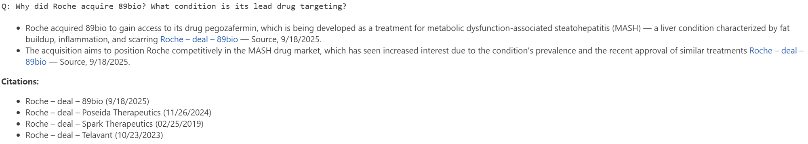

# Biopharma Deals RAG Demo

This project demonstrates a **retrieval-augmented generation (RAG)** system over ~265 BioPharma Dive deal announcements.  
It allows natural-language Q&A with **grounded answers and citations** about acquisitions, deal values, CVRs, advisors, and therapeutic focus.

---

## 🎬 Demo



---

## ⚡ Quickstart

```bash
# create environment
conda env create -f environment.yml
conda activate rag-demo

# start notebook
jupyter lab notebooks/01_langchain_rag_demo.ipynb
```

Set your OpenAI API key in the environment:

```bash
export OPENAI_API_KEY=your_key_here
```

---

## 📒 Demo Notebook

The notebook (`notebooks/01_langchain_rag_demo.ipynb`) includes curated example queries:

- List all 2025 deals that included contingent value rights (CVRs)
- Compare the CVR structures in the Roche–89bio and Pfizer–Metsera deals
- Summarize the deal values and contingent payouts for Roche–89bio and Novartis–Tourmaline
- List the most frequently mentioned financial advisors in September 2025
- Why did Roche acquire 89bio? What condition is its lead drug targeting?
- Which deals focus on cardiovascular or liver diseases?

Answers are provided in concise bullets with **source-linked citations**.

---

## 📂 Repo Structure

```
rag-health-news/
├─ data/
│  └─ processed/records.json           # source dataset (not included here)
├─ src/
│  ├─ index_json.py                    # build FAISS index
│  └─ demo_query.py                    # example query script
├─ notebooks/
│  └─ 01_langchain_rag_demo.ipynb      # demo walkthrough
├─ environment.yml                     # reproducible conda env
├─ .env.example                        # example .env (just API key)
├─ .gitignore
└─ README.md
```

---

## 🚀 Next Steps (MVP → Production)

- Automate ingestion of new deal articles (daily pipeline)
- Add filters (company, date range, therapeutic area)
- Provide a simple UI (Gradio/Streamlit) for analyst-facing use
- Collect feedback (“Was this useful?”) to improve retrieval and prompts

---

*Data: BioPharma Dive articles. Used here for demo purposes only. Dataset not included for licensing reasons. Any JSON/CSV with title, date, article_text, and source_url fields can be indexed with src/index_json.py.*
